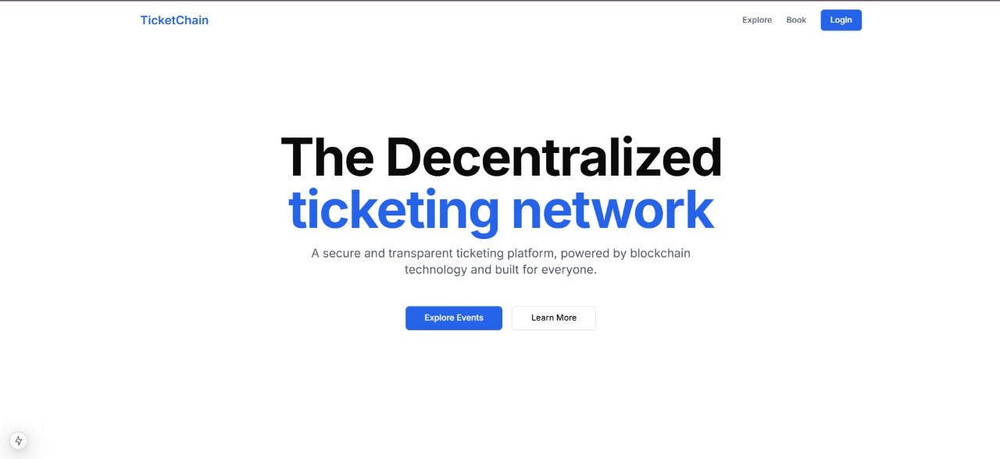
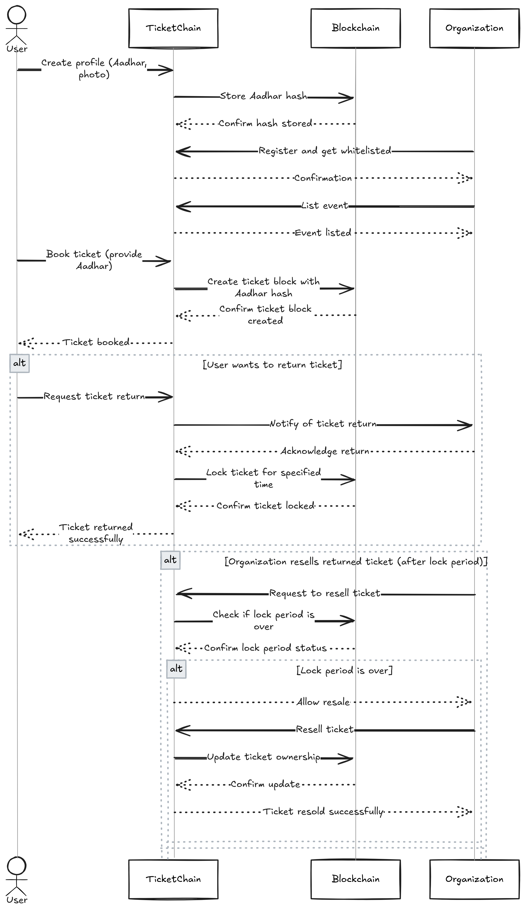

# TicketChain - Web3 Event Ticketing Platform
## Overview
TicketChain is a decentralized event ticketing platform designed to tackle the issue of black market ticketing. It leverages Web3 technology for ticketing transparency and provides a secure way to buy, sell, and return event tickets.

## Features
1. Event Exploration: Users can browse a list of events, including their details like title, date, location, price, and category.
2. Ticket Purchase: Users can click the "Buy Ticket" button to purchase a ticket for an event.
3. Ticket Return: After a ticket is purchased, a "Return Ticket" button will be displayed, allowing users to return their ticket.
4. Event Creation - Organizations can list their events on the platform for smooth decentralised management.

## Getting Started

To run the project locally, follow these steps:

1. Clone the repository.
2. Install dependencies using `npm install`.
3. Run the app with `npm run dev`.

## How It Works

### 1. **User Registration**

Users can register on TicketChain by providing their Aadhar card number after user authentication on Web3Auth. The Aadhar information is hashed and stored securely on the blockchain to ensure authenticity.

### 2. **Browse Events**

After logging in, users can browse through various events sorted by category, price, or date.

### 3. **Ticket Purchase**

Tickets are purchased directly on the platform, and payment is done through various payment options.

### 4. **Return Ticket**

In case user is unable to use his ticket, he can return his ticket to the platform only and get his cancelled ticket refund.

### 5. **Refunds & Re-listing**

Tickets that are returned after the refund process are re-listed for sale, ensuring no tickets go unused.

## Setup & Installation

To run TicketChain locally, follow the steps below:
1. Clone the repository.
2. Install dependencies using `npm install`.
3. Run the app with `npm run dev`.
### Prerequisites

- Node.js (>=16.0.0)
- MongoDB
- Web3Auth (for Web3 login integration)